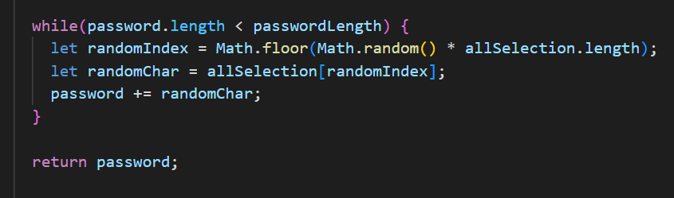

# JavaScript: Password Generator

## Description

This website has been developed using a Javascript, a HTML and a CSS starting code provided by the tutors as a base to create a tool that by a click in a bottom will create a customized password attending the end-users requirements.

As a challenge, it has really challenged me, because besides having to figure out what needs to be done to create a random password to attend the requirements, it also required some further research to have a better understand about methods and functions in Javascript.

Attention to details was the most challenging part, once one of the requirements was ensure that all the data required by the end-user have been inputed into the final result.

Therefore, understanding what was purposed is crucial as a starting point to make sure that any requirement will not be missed.

## Usage
The webpage has been developed using VS Code, where the structure was created in HTML, CSS and the interaction with the end-user was developed using Javascript. 

The webpage is an interactive way to help the end-users to create random passwords according with their own requirements, where they can choose what kind of elements will be add in the password and how long it will be respecting a lenght from 8 to 128 characteres.

The image below shows the main section of the website, where a container contain a text area that will display the final result and a buttom which will activate a prompt to be filled with the end-users requirements.

By clicking on the buttom 'Generate Password' an event "click" will be activate, then a prompt will be opened where the end-users have the opportunity to start inputing data about how they want to customize their password.

Below represents the first display faced by the end-user to input the lenght of the password, which must attend the requirements described.

The following images represents possible erros that may happen if the end-user rather using numbers to fill the box he uses letters, special characteres or even if any value has been inputed.

If the data inputed attends the requirements, then a group sequencial boxes will be displayed to give the opportunity to the end-user chooses what kind of data he wants to have in his password (lowercases, uppercases, numbers and special characteres).

As soon as the end-user finishes confirming what he wants or not in his password, the function will be displayed to the screen with a random password that contains everything as required.

## Development & Deployment

The code to create the website was developed using Javascript, where it was possible create interaction by using events as "click" on the buttom and a group of comparisons of the data inserted to attend the acceptance criteria. 

The screenshot below shows part of the code where a function is created and a group comparisons happen using a functionality "if" to manage what kind of data will be storaged.
In addition, it is notable a suffle of the elements required to be sort out and inputed to a new element.

In the end the of the functions is created a repetition scheme as a looping (while) that will be displayed and ensure that the number of elements of the password lenght will attend the requirements of the end-user, then a value will be set to the passsword that will use the value when display the main function "writePassword()".

On the top of the code we have the main function of the code that will receive all the values processed as shown above and then display the final result to the end-user.

### Deployed Website

To have a better understanding of what was happening behind the scenes to create the final result, I have inserted some codes on Console log to follow how it was working.

https://robinsonfdossantos.github.io/Generate-Password/

For more information, use the browser's DevTools by typing Ctrl + Shift + I.

## Credits

Members of the Bootcamp team, and in special to Meeks Gombe, Dominique who helped me to understand and overcome all my doubts through a 1:1 tutor session.

## License

Licensed under the MIT license.
